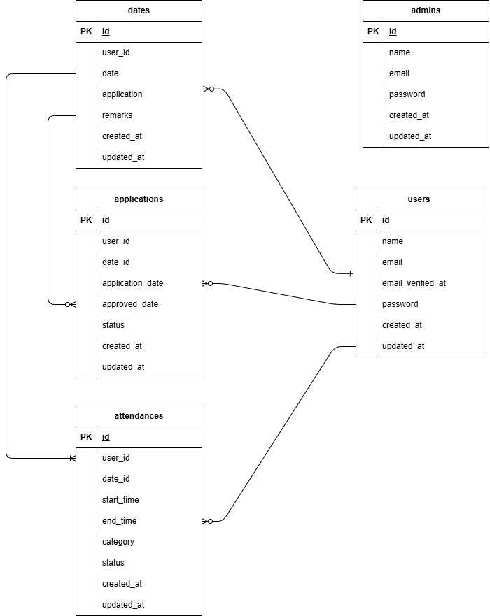

# attendance
## プロジェクト概要
ユーザーが勤怠の登録、勤務状況の確認、勤怠情報の修正申請ができ、管理者がユーザーの勤怠状況の確認と修正承認できる機能をもつ勤怠管理アプリの作成

## 環境構築
Dockerを起動する
1. git git@github.com:poteneko3104-creator/attendance.git
2. DockerDesktopを立ち上げる
3．docker-compose up -d --build

Laravel環境構築
1. docker-compose exec php bash
2. composer install
3. composer create-project "laravel/laravel=8.*" . --prefer-dist
4. 「.env.example」ファイルを 「.env」ファイルに命名を変更。または、新しく.envファイルを作成
5. .envに以下の環境変数を追加

        DB_CONNECTION=mysql
        DB_HOST=mysql
        DB_PORT=3306
        DB_DATABASE=laravel_db
        DB_USERNAME=laravel_user
        DB_PASSWORD=laravel_pass

6. アプリケーションキーの作成
        php artisan key:generate
7. マイグレーションの実行
        php artisan migrate
8. シーディングの実行
        php artisan db:seed

fortifyインストール
1. docker-compose exec php bash
2. composer require laravel/fortify
3. php artisan vendor:publish --provider="Laravel\Fortify\FortifyServiceProvider"

PHPunit実装
1. docker-compose exec php bash
2. composer require --dev phpunit/phpunit

Mailhogの実装
1 .envに以下の環境変数を追加

        MAIL_MAILER=smtp
        MAIL_HOST=mailhog
        MAIL_PORT=1025
        MAIL_USERNAME=null
        MAIL_PASSWORD=null
        MAIL_ENCRYPTION=null
        MAIL_FROM_ADDRESS=example@aaa.com

## 使用技術(実行環境)
 nginx:1.21.1
 mysql 8.0.26
 PHP 8.1.34
 Laravel Framework 8.83.29
 laravel/fortify

 ## ER図

## テストアカウント
一般ユーザー
name:user1
email:user@aaa.com
password:user1234

管理者ユーザー
name:admin
email:admin@aaa.com
password:admin1234
